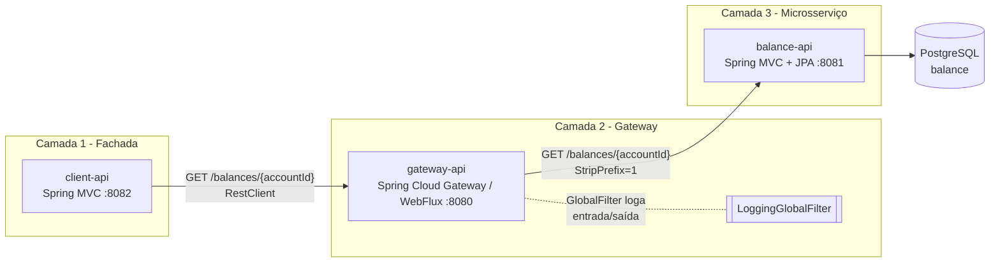

# api-gateway-demo

Projeto de estudo do padrão **API Gateway**: uma aplicação cliente expõe uma fachada REST,
que fala com um gateway (Spring Cloud Gateway), que roteia para um microsserviço de saldo.
Sem Kafka, sem mensageria — cadeia 100% síncrona via REST, propositalmente simples para
focar no papel de cada camada.

Projeto irmão de estudo com abordagem orientada a eventos: `../banco-digital-kafka`
(nomenclatura em português, Kafka, lock otimista). Aqui a nomenclatura é em inglês e a
comunicação é só HTTP.

## Arquitetura



## Fluxo de uma requisição

1. Um cliente HTTP chama `GET /balances/{accountId}` no **client-api** (porta 8082).
2. `client-api` é uma fachada REST pura: repassa a chamada via `RestClient` para o
   **gateway-api**, em `GET /api/balances/{accountId}`, e devolve o status/corpo da
   resposta tal como recebeu (sem lógica de negócio própria).
3. `gateway-api` casa a rota pelo predicado `Path=/api/balances/**` e aplica, nessa ordem,
   os filtros declarados na rota: `StripPrefix=1` (remove o `/api`) e `AuthTokenFilter`
   (simula validação de token — só loga se o header `Authorization` veio ou não, sempre
   autoriza) antes de encaminhar para `balance-api`.
4. Independente da rota, o `LoggingGlobalFilter` (filtro global, roda em todas as rotas)
   loga a requisição de entrada; ao concluir a chamada, loga o status de resposta (ou o
   erro) e o tempo total gasto.
5. `balance-api` busca todos os registros de saldo da conta no Postgres e responde com a
   lista de saldos por tipo. Se a conta não tiver nenhum registro, responde `404`.

## Serviços

| Serviço | Porta | Papel | Stack |
|---|---|---|---|
| client-api | 8082 | Fachada REST para o cliente final; sem regra de negócio, só repassa para o gateway | Spring MVC, `RestClient` |
| gateway-api | 8080 | Roteamento HTTP + filtro global de log | Spring Cloud Gateway (WebFlux) |
| balance-api | 8081 | Consulta de saldo por conta (somente leitura) | Spring MVC, Spring Data JPA, PostgreSQL |
| postgres | 5432 | Banco único do balance-api | PostgreSQL 16 |

## Endpoints

| Camada | Método e caminho | Descrição |
|---|---|---|
| client-api | `GET /balances/{accountId}` | Fachada pública; repassa para o gateway |
| gateway-api | `GET /api/balances/{accountId}` | Rota pública do gateway (`StripPrefix=1` remove o `/api` antes de encaminhar) |
| balance-api | `GET /balances/{accountId}` | Endpoint real, consulta direta ao Postgres |

Resposta de sucesso (`200`), igual em todas as camadas:

```json
{
  "accountId": 1,
  "balances": [
    { "type": "CONTA", "amount": 1000.0000 },
    { "type": "LIMITE_ESPECIAL", "amount": 500.0000 }
  ]
}
```

Conta sem saldo cadastrado retorna `404` em todas as camadas.

## Modelo de dados

Tabela única `balance` (schema em [`balance-api/db/schema.sql`](balance-api/db/schema.sql)),
um registro por conta **e** tipo de saldo:

| Coluna | Tipo | Observação |
|---|---|---|
| id | BIGINT IDENTITY | PK técnica |
| account_id | BIGINT | id da conta |
| type | VARCHAR(20) | `CONTA` ou `LIMITE_ESPECIAL` (enum `BalanceType`) |
| amount | NUMERIC(19,4) | valor do saldo |
| updated_at | TIMESTAMP | |

Restrição única em `(account_id, type)` — cada conta tem no máximo um registro por tipo.
A conta `1` já vem populada via seed (`CONTA` = 1000.00, `LIMITE_ESPECIAL` = 500.00).

## Padrões usados

- **API Gateway** — ponto único de entrada que roteia para os microsserviços; permite
  adicionar cross-cutting concerns (log, e futuramente auth/rate limit) sem tocar nos
  serviços de negócio.
- **BFF-like facade** (`client-api`) — camada dedicada ao cliente final, isolada do
  gateway e dos microsserviços internos.
- **GlobalFilter** (`LoggingGlobalFilter`) — filtro reativo (`Mono`) aplicado
  automaticamente a todas as rotas do gateway, sem precisar declarar filtro por rota.
- **GatewayFilterFactory nomeado** (`AuthTokenFilter`, classe
  `AuthTokenFilterGatewayFilterFactory`) — filtro *por rota*, ao contrário do
  `GlobalFilter`: só se aplica onde é declarado em `filters:`. Usado aqui para simular
  validação de token (sempre aprova, só loga) — o padrão certo para o dia em que só
  algumas rotas precisarem de autenticação e outras não.
- **Somente leitura no balance-api** — sem métodos de escrita expostos; o serviço existe
  só para consulta, o que simplifica o design (sem lock otimista, sem `@Version`).

## Como rodar

```bash
cd api-gateway-demo
docker compose build
docker compose up -d
```

Depois, testar a cadeia completa:

```bash
curl http://localhost:8082/balances/1     # via client-api (cadeia completa)
curl http://localhost:8080/api/balances/1 # via gateway-api (pula o client-api)
curl http://localhost:8081/balances/1     # direto no balance-api
```

Para acompanhar o `LoggingGlobalFilter` em ação:

```bash
docker compose logs -f gateway-api
```

Encerrar e limpar:

```bash
docker compose down --rmi local -v
```

## Testes

Cada serviço tem testes unitários (JUnit 5 + Mockito + AssertJ/StepVerifier), sem contexto
Spring nem Testcontainers:

- `balance-api`: mapper, service e controller (`MockMvc` standalone).
- `gateway-api`: `LoggingGlobalFilterTest` (`StepVerifier` sobre o `GatewayFilterChain`
  mockado — sucesso, erro e ordem do filtro) e `AuthTokenFilterGatewayFilterFactoryTest`
  (com e sem header `Authorization`, sempre autoriza).

## Limitações conhecidas

Projeto didático, sem pretensão de produção:

- Sem autenticação/autorização em nenhuma camada.
- Sem circuit breaker, retry ou rate limiting no gateway.
- Um único Postgres, sem réplica/HA.
- `client-api` só repassa `GET`; não há criação/atualização de saldo nesta versão.
- `LoggingGlobalFilter` só loga em texto simples (sem correlação de trace id entre
  camadas, sem structured logging).
